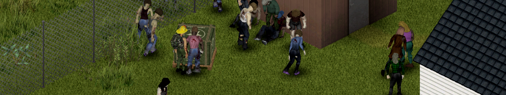

# Military Drop: guide / guide du joueur

| English | Français |
|---|---|
| [Guide home](en/README.md) | [Sommaire](fr/README.md) |
| [1. Getting started](en/01-getting-started.md) | [1. Démarrer](fr/01-getting-started.md) |
| [2. Calling a drop](en/02-calling-a-drop.md) | [2. Appeler un largage](fr/02-calling-a-drop.md) |
| [3. Requisition form](en/03-requisition-form.md) | [3. Formulaire de réquisition](fr/03-requisition-form.md) |
| [4. Trust and missions](en/04-trust-and-missions.md) | [4. Confiance et missions](fr/04-trust-and-missions.md) |
| [5. Liaison post](en/05-liaison-post.md) | [5. Poste de liaison](fr/05-liaison-post.md) |
| [6. Server admin](en/06-server-admin.md) | [6. Administration](fr/06-server-admin.md) |
| [7. FAQ](en/07-faq.md) | [7. FAQ](fr/07-faq.md) |

Build 42.21 · single player and multiplayer / solo et multijoueur.

Pictures marked "out-of-game render" come from the mod's preview tools (`source/*/preview.py`); the others are in-game screenshots. / Les images marquées « rendu hors jeu » viennent des outils d'aperçu du mod ; les autres sont des captures en jeu.
