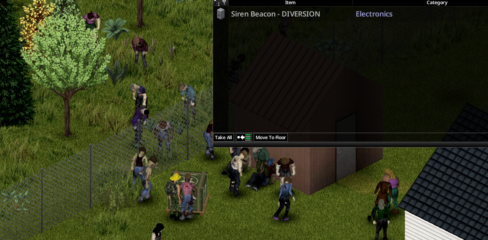

# Getting started

[Français](../fr/01-getting-started.md) · [Guide home](README.md) · Next: [Calling a drop](02-calling-a-drop.md)

Military Drop lets you call the army by radio for a supply airdrop. A helicopter flies over, drops a crate far from you, and announces where it landed to anyone listening. The noise draws the dead.

## Install

1. Subscribe to **Military Drop** on the Steam Workshop (Build 42.21).
2. In the game's mod list, enable **Military Drop** (mod ID `batman_MilitaryDrop`).
3. Start a game. The settings are on the **Military Drop** page of the sandbox options.

No other mod is required. You can add the mod to an existing save: military notes and codebooks appear on zombies killed after it is enabled.

## What you need

- **A military radio.** Only these can call the base:
  - US Army Walkie Talkie (in hand, in a bag, or placed on the ground; clipped to the belt it only listens);
  - US Army Manpack Radio;
  - US Army Ham Radio (placed). It can also become your [liaison post](05-liaison-post.md).
- **The military frequency.** It is written on military memos carried by military and police zombies. It is different in every game.
- **The authentication code**, which changes every Monday. By default it is broadcast in code by a numbers station and deciphered with a military codebook. See [Calling a drop](02-calling-a-drop.md).
- **Batteries**, and a way to deal with the horde that comes with every drop.

## Your first drop, in short

1. Kill military or police zombies until you find a **Military Memo**. Right-click it, **Inspect**: note the circled frequency and the numbers station.
2. Listen to the numbers station, find a **Military Codebook** and decode this week's code.
3. Tune your military radio to the military frequency. Right-click it, **Device Options**, open the **Logistics** section, type the code and press **Request a supply drop**.
4. Fill the [requisition form](03-requisition-form.md) and transmit it.
5. **Keep the radio on and tuned**: the grid is announced when the crate lands, then repeated every 6 hours by default until someone opens a supply case. Follow it, kill the horde, open the crate.

Then keep the base happy: [trust and missions](04-trust-and-missions.md) shorten the wait between drops and unlock better supplies.

## Single player and multiplayer

The mod works in both. In multiplayer the server decides everything:

- the wait between drops is shared by the **whole server** (one week of game time by default);
- each faction is a **station** with its own call sign; trust belongs to each character (a player without a faction is a station alone);
- to transmit, your character takes the walkie-talkie in hand automatically;
- drop coordinates are broadcast to everyone listening on the frequency. Other players can reach your crate first.

## Compatibility

- **HEF - Helicopter Event Framework**: designed to coexist. The supply helicopter waits while a HEF event is active near its target, and the mod never uses 112.2 MHz (reserved by HEF).
- **Signal Smoke** (optional): when it is active, green smoke marks the crate for 60 minutes of game time.
- **Item and weapon mods**: crate contents come from the game's loot tables, including the items added by your other mods.
- **Expanded Helicopter Events** is not needed. Military Drop is a standalone rewrite of the Build 41 mod "Drop Military Cargo".
