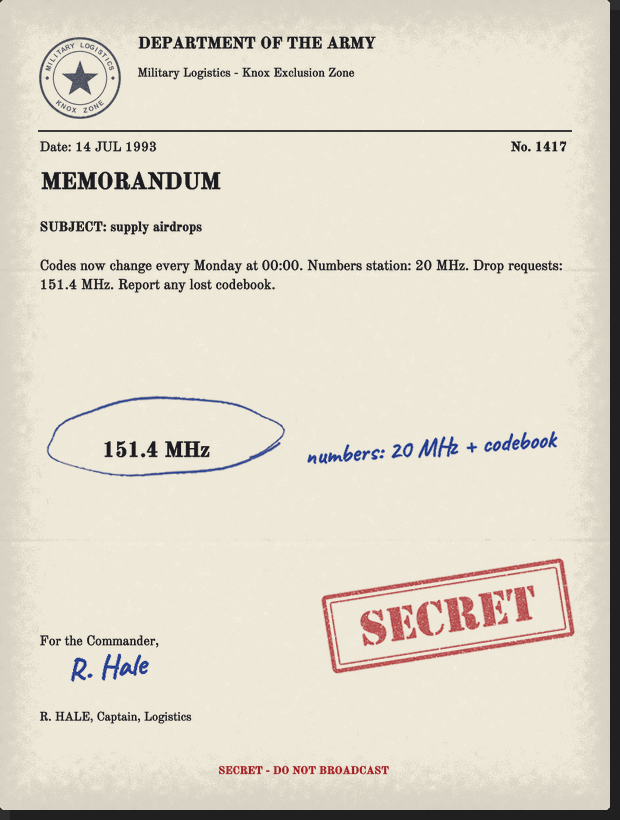
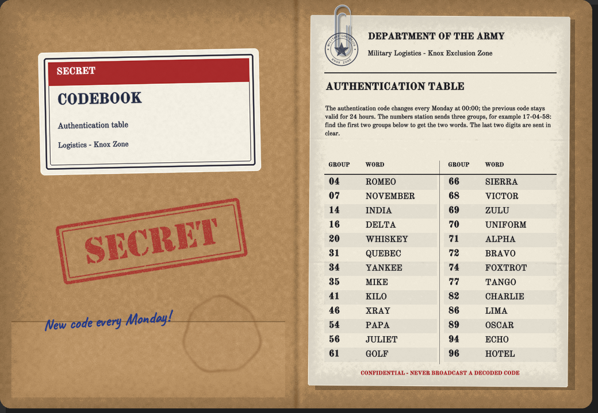

# Calling a drop

[Français](../fr/02-calling-a-drop.md) · [Guide home](README.md) · Previous: [Getting started](01-getting-started.md) · Next: [Requisition form](03-requisition-form.md)

## 1. Find the military frequency

Military and police zombies sometimes carry a **Military Memo** (about 1 in 50 by default). Right-click it and choose **Inspect**.

*Out-of-game render. In your game the frequencies are different.*

- The frequency **circled in pen** is the military frequency. The server picks it at random for each game, between 120 and 170 MHz.
- The handwritten note tells you how to get the code. With the default settings: the frequency of the **numbers station** and "+ codebook".

## 2. Get this week's code

A code is two words of the military alphabet and two digits, for example `BRAVO-KILO-42`. Case, spaces and hyphens do not matter.

The code changes **every Monday at 00:00** (game calendar). The previous code is still accepted for 24 hours.

### The numbers station

Every 30 minutes of game time, a numbers station broadcasts on shortwave (between 10 and 25 MHz):

> Attention. Attention. Message follows.
> Group: 17-04-58. (three times)
> End of message. End of message.

You can hear it with a military radio, a ham radio or the best civilian walkie-talkie.

### The codebook

Military zombies sometimes carry a **Military Codebook**, and it can be found in army storage. There is one table per game: every codebook you find is the same.

*Out-of-game render.*

Look up the first two groups in the table to get the two words. The last two digits are sent in clear. With the table above, `20-71-58` gives `WHISKEY-ALPHA-58`.

*In game: the codebook and a memo. Your frequencies are different.*

> The server may use a simpler mode: no code at all, a fixed code written on the memos, or this week's code written in clear on the memos. See [Server admin](06-server-admin.md).

## 3. Call the base

1. Turn your military radio on and tune it to the military frequency (vanilla **Channel** section). Save it with **Add preset**: you will need it again for the drop announcement.
2. Right-click the radio and choose **Device Options**.
3. Open the **Logistics** section at the bottom of the radio window.
4. Type the code in the **Code** field. It is remembered for this character, even after you reload.
5. Press **Request a supply drop**.

*In game: the frequency saved as a preset ("150.6 MHz drop"; yours is different) and the Logistics section at the bottom.*

A greyed button tells you why in its tooltip (radio off, code missing...). Your character speaks, and the base answers after a few seconds.

Where the radio can be:

- **in your hands**;
- **on your belt**: listening only. The mod adds **Device Options** to a clipped walkie-talkie; it stays on and shows what it receives above your character, but the call buttons are greyed: take it in hand to talk;
- **in a bag**: **Device Options** takes it in hand and opens its window;
- **on your back**: in single player. In multiplayer your character takes it in hand;
- **placed on the ground**, within 2 tiles.

A placed **US Army Ham Radio** shows a single **Liaison post** button instead: drops are then requested from the [liaison post console](05-liaison-post.md).

### The base's answers

- **"...static. Nobody answers on this frequency."** Wrong frequency **or** wrong code: you cannot tell which.
- After **3 wrong codes in one day**, the base ignores you until the next day, even with the right code.
- **"I can't reach them right now. I should try again in N hours."** The wait between drops is not over. By default: one drop per week of game time for the whole server, shorter or longer depending on your [trust](04-trust-and-missions.md).
- **"...Your personal authorization is suspended..."** Your trust fell too low: the line is cut for a few days.
- **"...Send your requisition, over."** Accepted: fill the [requisition form](03-requisition-form.md). If the server disabled the form, the drop leaves at once with random supply cases.

## 4. The helicopter

On the military frequency, the base announces: *"All stations, Logistics. Supply helicopter en route to a requested drop zone, ETA one minute."*

The drop point is **150 to 400 tiles** from the caller, on a road or next to a building, never in water. You hear the helicopter pass, see its **shadow** on the ground and a **direction arrow** while it is within 400 tiles. It hovers a few seconds over the point, then leaves.

> **Drop zones.** On some servers, usually PvP ones, the admin defines **drop zones**. The crate then falls in one of these zones, often in the nearest contested town, instead of 150 to 400 tiles from you, still never in water. Admins: see [Drop zones](06-server-admin.md#drop-zones).

The helicopter stops when the game is paused, and resumes its flight after a save and reload.

## 5. Announcement and map marker

When the crate drops: *"Supply crate delivered at grid X / Y. I repeat, grid X / Y."* then *"Logistics out."*

On a server with drop zones, the announcement and its reminders may also give the zone name: *"Supply crate delivered at LZ Central Park, grid X / Y."*

Every radio **on and tuned** to the military frequency at that moment hears it, and its owner gets a green **target** symbol on the map. Turned off or on another channel: no marker. In multiplayer, other players hear it too.

> **Keep a radio on and tuned to the military frequency.** A radio that is off, out of battery or on another channel hears nothing, and you get no marker. A walkie-talkie clipped to the belt keeps listening while you move.

### Grid reminders

Missed it? The base repeats the grid of every drop whose supply cases are all still unopened: *"All stations, Logistics. Supply crate still awaiting pickup at grid X / Y."* By default every **6 hours** of game time, for up to **48 hours**; the reminders stop as soon as someone opens a supply case. A reminder works like the announcement: only a radio that is on and tuned hears it and marks your map. Everyone listening hears it too, so others may race you to the crate.

### Map symbols

The base marks your map only if one of your radios **hears** the announcement. The symbols are the game's own map symbols: you can erase them like any map note.

| Symbol | Meaning | Where |
|---|---|---|
|  | **Supply drop**: the announced grid of a crate (or of a decoy, which looks the same) | On a road or next to a building, never in water |
|  | **Reconnaissance**: the building or road to check | Confirm within 25 tiles of the symbol |
|  | **Clearance**: centre of the zone where the horde was reported | The horde is spread within 40 tiles around it |

Symbols stay on the map after the mission or the drop: erase them yourself when you no longer need them.

## 6. The crate

Go to the grid. The crate appears when someone arrives and the area is loaded, at most 30 tiles from the announced point. A horde waits around it (3 to 30 zombies by default).

*Out-of-game render of the crate.*

- Open the crate's trunk like a vehicle trunk: **Military Supply Crate**.
- Take the cases out, right-click each one: **Open Supply Case**. Contents are drawn from the game's loot tables (and your mods). A weapon comes with 2 magazines and 1 box of ammunition.
- With **Signal Smoke**, green smoke marks the crate for 60 minutes of game time.

Be quick: the first case opened by the requesting character gives **+10 trust**. If nothing is opened within 48 hours of game time, the drop is lost (**-10**). If another member of the calling faction opens it first, your character earns 5; if an outsider opens it, your character loses 5. The opener earns nothing.

### Dismantle the empty crate

Empty the crate, carry a **hammer** and a **saw**, right-click it: **Dismantle the crate**. You get planks (or unusable wood) and Carpentry experience, like dismantling wooden furniture. The option is greyed with the reason if the crate is not empty or a tool is missing.
