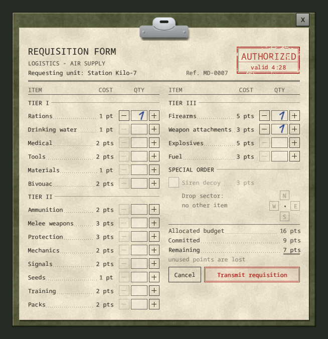
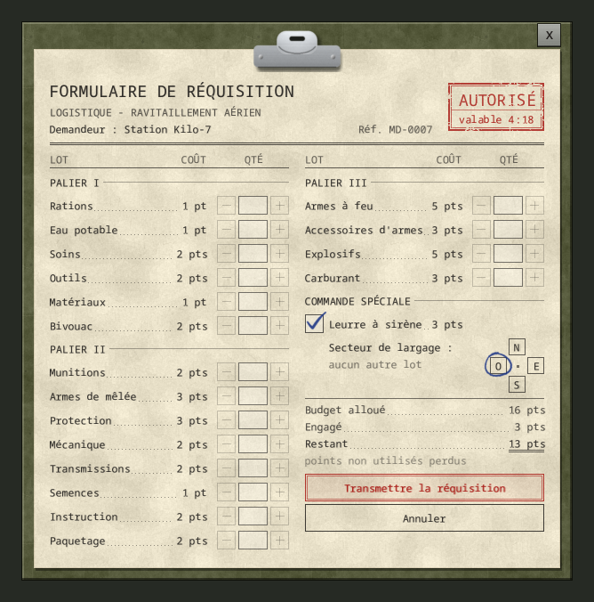

# Requisition form

[Français](../fr/03-requisition-form.md) · [Guide home](README.md) · Previous: [Calling a drop](02-calling-a-drop.md) · Next: [Trust and missions](04-trust-and-missions.md)

When the base accepts your call, it answers *"Station Kilo-7, this is Logistics. Send your requisition, over."* and the form opens next to the radio window. You choose what the helicopter brings.

*Out-of-game render.*

## Budget and tiers

The red **AUTHORIZED** stamp shows how long the form stays valid: **5 real minutes**.

Your **allocated budget** depends on your character's [trust](04-trust-and-missions.md):

| Trust | 25 (start) | 50 | 75 | 100 |
|---|---|---|---|---|
| Budget | 8 pts | 12 pts | 16 pts | 20 pts |

- **Tier I** is always open.
- **Tier II** opens at trust **50**.
- **Tier III** opens at trust **75**.

A locked line is struck through and shows the trust it needs, for example "trust 50+". **Unused points are lost.**

## The 18 lots

Each unit you order arrives as one **Requisition Case**. Items are drawn when the case is opened, from the game's loot tables (and your mods' items).

| Tier | Lot | Cost | One case holds |
|---|---|---|---|
| I | Rations | 1 pt | 4 long-life foods: tins, dry goods |
| I | Drinking water | 1 pt | 2 bottles or canteens, full of clean water |
| I | Medical | 2 pts | 3 first aid supplies and bandages |
| I | Tools | 2 pts | 2 hand tools |
| I | Materials | 1 pt | 4 building and crafting materials |
| I | Bivouac | 2 pts | 3 camping, fire, fishing or trapping items |
| II | Ammunition | 2 pts | 3 rounds, boxes or magazines |
| II | Melee weapons | 3 pts | 1 proper close combat weapon |
| II | Protection | 3 pts | 2 pieces of protective gear or body armor |
| II | Mechanics | 2 pts | 2 vehicle parts or maintenance supplies |
| II | Signals | 2 pts | 2 radios, electronics or lights |
| II | Seeds | 1 pt | 3 seeds or gardening supplies |
| II | Training | 2 pts | 2 skill books |
| II | Packs | 2 pts | 1 bag or container |
| III | Firearms | 5 pts | 1 firearm, 2 magazines and a box of rounds |
| III | Weapon attachments | 3 pts | 2 sights, lights or other weapon parts |
| III | Explosives | 5 pts | 2 bombs or incendiary devices |
| III | Fuel | 3 pts | 1 fuel can, full of gasoline |

The server admin can change costs, tiers and lots, or disable explosives. Your form always shows the server's real list.

## Drop sector

On a server with [drop zones](06-server-admin.md#drop-zones) where the admin lets players choose the sector, the form has a **Drop sector** field above the budget: a town, shown as "< Louisville >". Click the arrows or the name, or use left and right on a gamepad.

- **Transmit requisition** stays greyed until you choose a sector ("choose a sector").
- With a single sector, it is already selected and simply shown.
- You choose the sector only: Logistics picks the exact spot inside it, never in water or inside a building. Zone names are never shown.
- A sector too close to you is not offered when the server sets a minimum distance.
- If the sector has no possible drop point right now, the base asks you to pick another sector and the form reopens, still filled in. With a single sector, try again later.
- The **Siren decoy** uses the same field: when it is ticked, the decoy falls in the chosen sector instead of your order.

## Send or cancel

- Use **+** and **-** to set quantities. **+** is greyed when the budget no longer allows it.
- **Transmit requisition**: your character reads the requisition, the base confirms, and the helicopter leaves as usual. The radio announcement never says what you ordered.
- **Cancel**, Escape, or walking away from a placed radio: nothing is spent and the wait between drops does not start. Call again when you are ready.
- If another player gets a drop while your form is open, your order is refused: the wait has started for the whole server.

In the crate's trunk you find one case per unit, named after its lot, for example **Requisition Case: Rations**. Right-click it: **Open Supply Case**.

*In game: the form opens next to the liaison post console.*

## Siren decoy

Under **SPECIAL ORDER**, the **Siren decoy** (3 pts) drops a dummy crate whose siren draws the infected away from you.

*Out-of-game render (French version).*

1. Tick **Siren decoy**. The other lots are disabled: a decoy is ordered alone.
2. Choose the **drop sector**: N, E, S or W. The crate falls in that quarter, at the usual distance.
3. Transmit.

On a server with [drop zones](06-server-admin.md#drop-zones), step 2 offers a **sector** instead of N, E, S and W: a town, shown as "< Louisville >" (arrows, or left and right on a gamepad). With a single sector, it is already selected. The decoy then falls in a drop zone of that sector, like a real drop. If the form has a [Drop sector](#drop-sector) field, step 2 uses that field: the decoy has no selector of its own.

The decoy looks **exactly** like a real drop: same answer, same helicopter, same announcement, same crate. Nobody can tell before opening the trunk, which holds only a **Siren Beacon - DIVERSION**.

- The siren starts when the crate lands and sounds for **6 hours** of game time. Zombies hear it up to **120 tiles** away, while the area around the crate is loaded.
- To stop it: right-click the crate, **Switch off the siren**. Dismantling the crate also stops it.
- A decoy never changes your trust.
- If the sector has no possible drop point (edge of the map), the base asks you to pick another sector and the form reopens.
