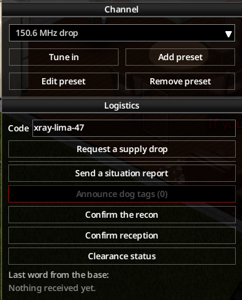
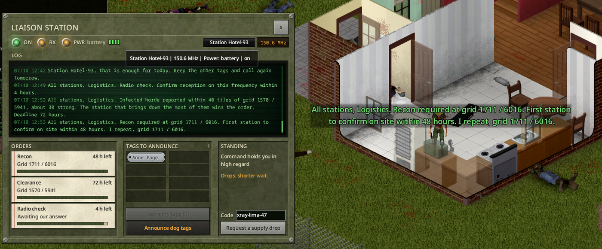

# Trust and missions

[Français](../fr/04-trust-and-missions.md) · [Guide home](README.md) · Previous: [Requisition form](03-requisition-form.md) · Next: [Liaison post](05-liaison-post.md)

## Breaking change in 0.1.2

**BREAKING CHANGE — 0.1.2:** Reputation belongs to each character, not the account or faction. Existing collective scores are not transferred: existing characters start at 25. Earlier drops do not affect the new scores.

## Your station

For the base, your group is a **station** with a call sign, for example "Station Kilo-7". In multiplayer a station is a faction; a player without a faction is a station alone. In single player you are one station.

The base keeps a **personal trust** score for each character, from 0 to 100. A new character starts at **25**, even on the same account. Saving, reconnecting or changing factions keeps the same score. You never see the number: the base tells you in words, in the tone of its answers and on the [liaison post](05-liaison-post.md) console:

| Trust | What command says |
|---|---|
| under 25 | Command distrusts you |
| 25 to 49 | Command is wary |
| 50 to 74 | Command trusts you |
| 75 and more | Command holds you in high regard |

## What trust changes

- **Wait between drops**: normal at 50, longer below (x1.25 at the start, x1.5 at 0), shorter above (x0.6 at 100).
- **Requisition**: a bigger budget and the higher tiers (II at 50, III at 75). See [Requisition form](03-requisition-form.md).
- **Line cut**: below **15**, the base refuses your drops for **3 days** of game time.

## Earn and lose trust

All values below are defaults; all durations are game time.

| Cause | Character affected | Gain / loss |
|---|---|---|
| Requester opens first case | Requester only | +10 |
| Another member of the calling faction opens first case | Requester only | +5 |
| Outsider opens first case | Requester only | −5 |
| No case opened within 48 h of delivery | Requester only | −10 |
| First daily situation report | Sender | +1 |
| Each valid, unused named dog tag | Sender | +2 |
| First recon confirmation within 25 tiles / 48 h | First confirmer | +3 |
| Most kills in clearance horde, 90% dead | Character with most kills | +5 |
| Radio check answered within 4 h, once per character | Each responder, once | +1 |
| 3 wrong codes / wrong-frequency calls in 1 h | Caller | −2 |
| Optional erosion after 24 h without contact | Idle character | −1 / +1 |

- Only the first supply case opened counts per drop. Another opener earns **0**; faction membership is checked at opening against the faction recorded when the drop was requested.
- Positive gains except drops share a **+8/day/character** cap. Scores stay within **0–100**.
- From the liaison post, the 50% bonus rounds up: report **+2**, dog tag **+3**, recon **+5**, radio check **+2**. These still share the cap. Clearance stays **+5**.
- Three wrong-code or wrong-frequency calls within one hour trigger **−2**, applied at the next hourly update, at most once per hour.
- Erosion is **disabled by default**. After 24 hours without contact, it moves the score one point per day toward 25 (−1 above, +1 below, 0 at 25).
- Expired missions, forced admin drops and decoys cause **0** change. Changing faction also causes **0**. A new character starts at **25**.

These exchanges need **no code**: only a military radio tuned to the military frequency. They are in the **Logistics** section of the radio window (**Device Options**).

*In game.*

## Daily report

**Send a situation report**: once per day of game time. A second report the same day is politely refused.

## Dog tags

Military zombies drop the game's own dog tags, engraved with the soldier's name. **Announce dog tags (N)** reads the names to the base:

- your own tag and blank tags do not count, nor a tag you wear or hold;
- each name counts once; an announced tag is set aside;
- when the daily limit is reached, the base says so and you keep the other tags for later.

## Missions

From time to time, the base gives an order to **all stations** on the military frequency. Missions are public: every station that hears them can compete. Only listeners get the map marker.

### Recon

*"All stations, Logistics. Recon required at grid X / Y. First survivor to confirm on site within 48 hours."*

A blue **eye** symbol marks the grid on your map. Go there and press **Confirm the recon** within **25 tiles** of the point. The first character gets +3.

### Clearance

*"All stations, Logistics. Infected horde reported within 40 tiles of grid X / Y, about 30 strong..."*

A red **skull** marks the zone. The horde appears when the first player comes near, out of sight. You have **72 hours** of game time.

- **Clearance status** asks the base how it is going: zombies of the horde brought down by your character, and how many are left.
- When **90%** of the horde is dead, the character that killed the most gets +5. Fire and traps kill zombies but credit nobody.

Map symbols of the missions:  reconnaissance,  clearance (see [Map symbols](02-calling-a-drop.md#map-symbols)).

### Radio check

*"All stations, Logistics. Radio check. Confirm reception on this frequency within 4 hours."*

Press **Confirm reception** in time. Every character that answers gets +1.

## Characters and factions

- Trust belongs to a character, never to an account or faction.
- Joining, leaving, founding or dissolving a faction never transfers trust.
- A new character starts at 25. Earlier drops and sanctions remain attached to the previous character.
- Factions keep their call signs and shared liaison posts. The console displays the acting character's trust.
- Upgrading from collective trust: old scores are preserved in legacy data, without transferring them. Each character starts at 25. Earlier drops do not affect the new scores.
