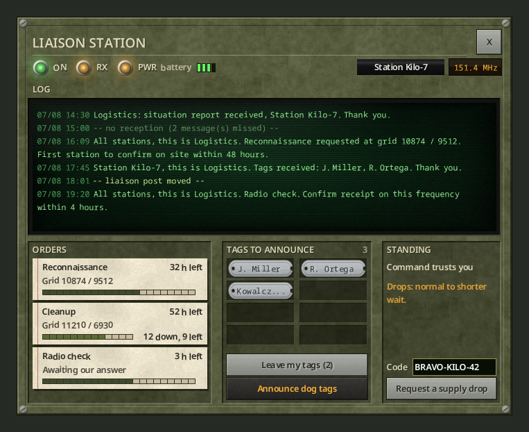

# Liaison post

[Français](../fr/05-liaison-post.md) · [Guide home](README.md) · Previous: [Trust and missions](04-trust-and-missions.md) · Next: [Server admin](06-server-admin.md)

A liaison post is a fixed military radio that your station uses as its base. It keeps a log of what the base says, shows your orders and trust, and gives more trust for announced dog tags.

*Out-of-game render.*

## Set up the post

1. Place a **US Army Ham Radio** (any fixed, high-end radio that can transmit works).
2. Power it (mains, generator or battery), turn it on, tune it to the military frequency.
3. Right-click it, **Device Options**. In the **Logistics** section, press **Liaison post**.

- The first time, the post is installed and the console opens.
- Each station has **one** post. On another radio, the button asks *"Move the liaison post here?"*.
- The button is greyed on another station's post.
- If the radio is picked up or destroyed, the post is lost. Install it again.

## The console

**Top**: three lamps. **ON** (powered and on), **RX** (blinks when a message comes in), **PWR** with the power source (mains, generator, battery) and the battery level. On the right: your call sign and the frequency.

**LOG**: everything the base says to your station or to all stations, with the date and time. The post only receives while it is on, powered and tuned. Otherwise a line marks the gap: *"-- no reception (3 message(s) missed) --"*. The post keeps receiving while you are away.

**ORDERS**: current missions, with the grid, the time left and a progress bar. Clearance shows "12 down, 9 left" (or "horde not spotted"); the radio check shows "Awaiting our answer" or "Receipt confirmed".

**TAGS TO ANNOUNCE**: the dog tags left at the post by your station's members (hover a tag to see who left it).
- **Leave my tags (N)** moves your fallen soldiers' tags from your inventory to the post.
- **Announce dog tags** reads them to the base. Tags announced from the post give 50% more trust.

**STANDING**: your trust in words, and its effect on drops ("Drops: shorter wait.").

**Code** and **Request a supply drop**: the same call as the radio window. The [requisition form](03-requisition-form.md) opens next to the console.

The console stays open while you use its buttons, and closes if you walk away from the radio.

> The console never tells you whether the radio is on the military frequency. Use the memos.
