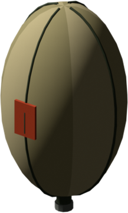
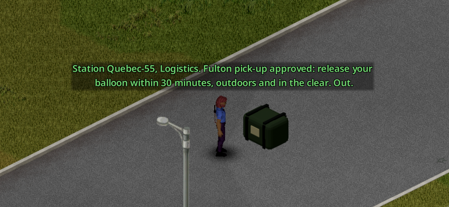
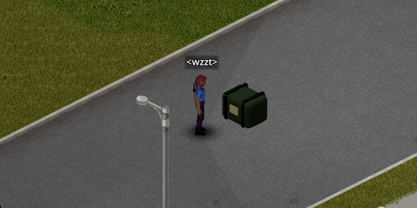
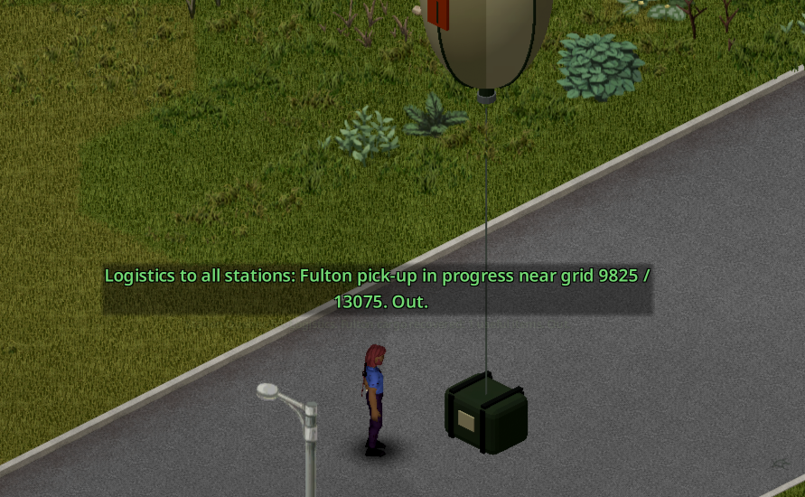

# Fulton extraction

[Français](../fr/07-fulton.md) · [Guide home](README.md) · Previous: [Server admin](06-server-admin.md) · Next: [FAQ](08-faq.md)

Command wants intelligence and gear from the infected zone. Pack them in a **Fulton recovery kit**, inflate its balloon with helium, and an aircraft snatches it on the fly. Command pays you in [trust](04-trust-and-missions.md).

The balloon is a 3D model of the mod: an olive envelope with seams and a red marker panel, tied by a cable to the green cargo bag.

## Getting a kit

The kit is single use: it leaves with the balloon.

**Craft it in three steps**

| Recipe | Uses up | Keeps | Skill |
|---|---|---|---|
| Sew Fulton balloon (gives the balloon envelope, a part) | 1 tarp, 6 uses of thread, 2 uses of glue | needle, scissors | Tailoring 3 |
| Make Fulton harness bag | 1 **empty** sandbag, 1 rope, 2 uses of duct tape | scissors | — |
| Assemble Fulton recovery kit | balloon envelope, harness bag, 3 uses of wire | pliers | — |

**Or repair a damaged one**

A damaged kit is a rare find: army storage, the pilot of a downed helicopter, or a supply crate dropped without an order. Repair it with 4 uses of thread, 2 of duct tape and 2 of wire (needle and pliers kept, Tailoring 1).

**Helium**

A **helium tank** holds four inflations. Look in gift and toy stores, and in army storage. An empty tank is kept; cut it up with a blowtorch (welding mask kept) for 4 small metal sheets and 2 steel chunks.

## Sending a Fulton

1. **Ask for a pick-up.** With a military radio on the military frequency (in hand, or placed within 2 tiles), open the radio's **Logistics** section and choose **Request a Fulton pick-up**. You then have **30 minutes** of game time. Asking again tells you how long is left. Missing the window costs nothing.

2. **Put the kit on the ground, outside**, under open sky, with no tree on its tile. Not in a thunderstorm or strong wind, not in a non-PvP zone or safehouse.
3. **Fill it** like any bag on the ground (capacity 10). Only items placed directly in the kit count; a bag inside the kit is lost. The balloon is already in the kit: there is nothing to attach.

4. Right-click the kit on the ground: **Inflate and release the Fulton** (you need a helium tank in your inventory). The option is greyed out with the reason if something is missing; in your inventory it tells you to put the kit on the ground. A confirmation lists what interests Command and what it will ignore, and warns you if today's credit is used up.
5. Your character walks to the kit and inflates it: about 10 seconds, and noise that draws the dead. It stops if you move or get attacked.
6. The balloon rises, the aircraft passes and takes it. Command confirms how many items it could use.

**Everyone hears it.** The pass is loud, and the military channel announces the 50-tile sector to every station. Choose your spot.

## What Command pays

The number is never shown in game. Values below are the defaults (server option `FultonValue`).

| Sent | Trust |
|---|---|
| ID card, passport, press badge or badge with someone else's name | +3 |
| Paperwork, document | +1 |
| Stash map | +4 |
| Hazmat suit | +6 |
| Gas mask or NBC mask (filter fitted or not), SCBA | +2 |
| Gas mask filter | +1 |

Everything else leaves with the balloon and is lost: your own ID card, a stolen or blank card, ordinary maps, respirators, improvised masks, masks without a filter.

These gains share the **daily cap** (10 by default) with reports, dog tags and missions. What goes over the cap is lost: the confirmation warns you.

**With the Zombie Virus Vaccine mod**: blood samples +1, brain fluid +2 / +3 / +4 by quality, brains +3 (not rotten or burnt), vaccines +5 / +7 / +10. **The cure is worth +25, outside the daily cap.**

## Multiplayer

The server checks everything again when you release: kit on the ground within 2 tiles, tank in your main inventory, open window, spot, weather, protected zones. It also pays and removes the kit for everyone. Every player near the release point sees the balloon and hears the aircraft. The flight completes even if you die or disconnect.
