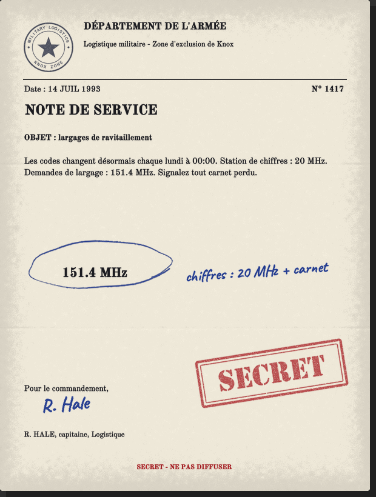
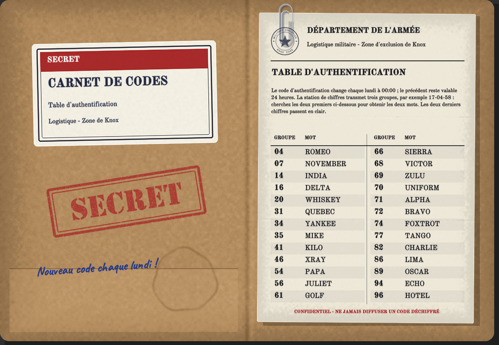
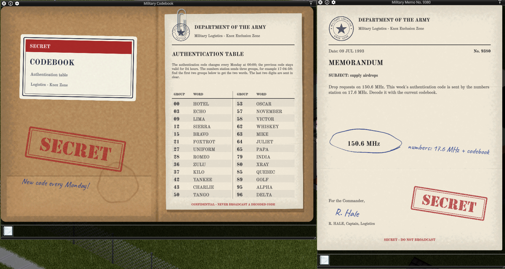
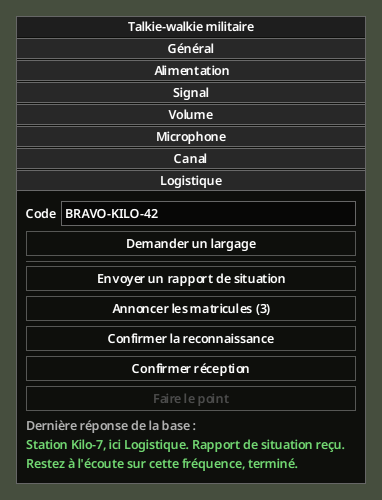
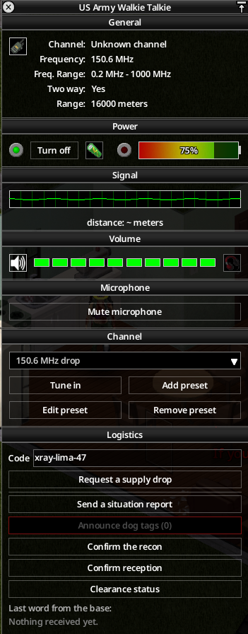
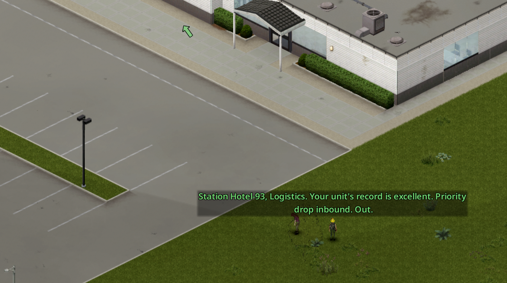
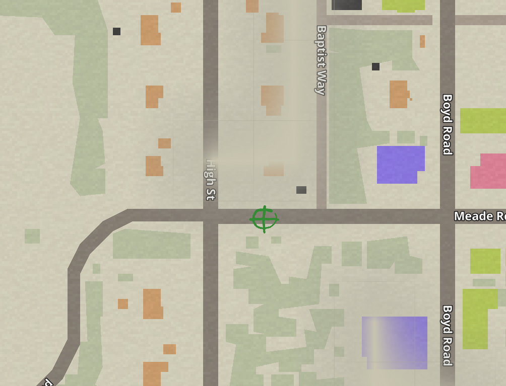
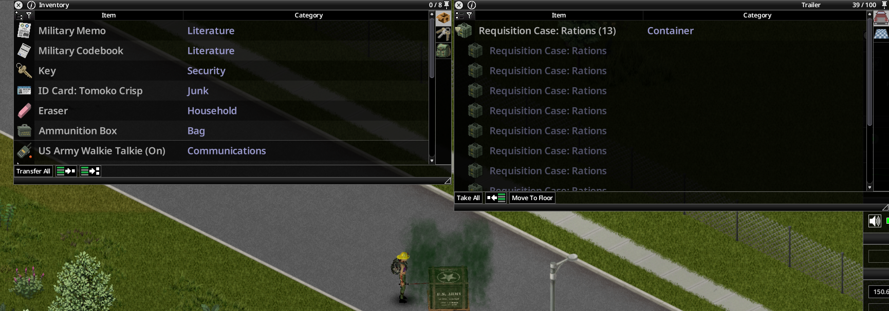
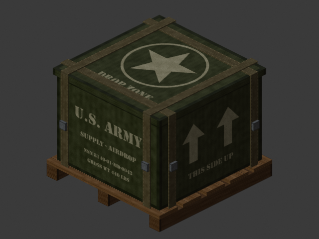

# Appeler un largage

[English](../en/02-calling-a-drop.md) · [Sommaire du guide](README.md) · Précédent : [Démarrer](01-getting-started.md) · Suivant : [Formulaire de réquisition](03-requisition-form.md)

## 1. Trouver la fréquence militaire

Les zombies militaires et policiers portent parfois une **Note de service militaire** (environ 1 sur 50 par défaut). Clic droit, **Inspecter**.

*Rendu hors jeu. Dans votre partie, les fréquences sont différentes.*

- La fréquence **entourée au stylo** est la fréquence militaire. Le serveur la tire au hasard pour chaque partie, entre 120 et 170 MHz.
- L'annotation manuscrite dit comment obtenir le code. Avec les réglages par défaut : la fréquence de la **station de chiffres** et « + carnet ».

## 2. Obtenir le code de la semaine

Un code se compose de deux mots de l'alphabet militaire et de deux chiffres, par exemple `BRAVO-KILO-42`. Majuscules, espaces et tirets n'ont pas d'importance.

Le code change **chaque lundi à 00:00** (calendrier du jeu). Le précédent reste accepté pendant 24 heures.

### La station de chiffres

Toutes les 30 minutes de jeu, une station de chiffres émet en ondes courtes (entre 10 et 25 MHz) :

> Attention. Attention. Message.
> Groupe : 17-04-58. (trois fois)
> Fin du message. Fin du message.

Elle s'écoute avec une radio militaire, une radio de radioamateur ou le meilleur talkie-walkie civil.

### Le carnet de codes

Les zombies militaires portent parfois un **Carnet de codes militaire**, qu'on trouve aussi dans les réserves de l'armée. Il n'y a qu'une table par partie : tous les carnets trouvés sont identiques.

*Rendu hors jeu.*

Cherchez les deux premiers groupes dans la table pour obtenir les deux mots. Les deux derniers chiffres passent en clair. Avec la table ci-dessus, `20-71-58` donne `WHISKEY-ALPHA-58`.

*En jeu : le carnet de codes et une note de service. Vos fréquences sont différentes.*

> Le serveur peut choisir un mode plus simple : aucun code, un code fixe écrit sur les notes, ou le code de la semaine écrit en clair sur les notes. Voir [Administration](06-server-admin.md).

## 3. Appeler la base

1. Allumez votre radio militaire et réglez-la sur la fréquence militaire (section **Chaîne** du jeu). Enregistrez-la avec **Ajouter un préréglage** : il vous la faudra encore pour l'annonce du largage.
2. Clic droit sur la radio, **Options de l'appareil**.
3. Ouvrez la section **Logistique**, en bas de la fenêtre radio.
4. Tapez le code dans le champ **Code**. Il est retenu pour ce personnage, même après un rechargement.
5. Appuyez sur **Demander un largage**.

*Rendu hors jeu.*

*En jeu (interface en anglais) : la fréquence enregistrée en préréglage (« 150.6 MHz drop » ; la vôtre est différente) et la section Logistique en bas.*

Un bouton grisé donne sa raison dans son infobulle (radio éteinte, code manquant…). Votre personnage parle, et la base répond après quelques secondes.

Où peut être la radio :

- **en main** ;
- **à la ceinture** : écoute seulement. Le mod ajoute **Options de l'appareil** au talkie accroché ; il reste allumé et affiche ce qu'il reçoit au-dessus de votre personnage, mais les boutons d'appel sont grisés : prenez-le en main pour parler ;
- **dans un sac** : **Options de l'appareil** le prend en main et ouvre sa fenêtre ;
- **sur le dos** : en solo. En multijoueur, votre personnage la prend en main ;
- **posée au sol**, à 2 cases au plus.

Un **Radioamateur de l'Armée américaine** posé n'affiche qu'un bouton **Poste de liaison** : les largages se demandent alors depuis la [console du poste](05-liaison-post.md).

### Les réponses de la base

- **« …grésillements. Personne ne répond sur cette fréquence. »** Mauvaise fréquence **ou** mauvais code : impossible de savoir lequel.
- Après **3 codes faux dans la journée**, la base vous ignore jusqu'au lendemain, même avec le bon code.
- **« Je ne peux pas les joindre pour l'instant. Je devrais réessayer dans N heures. »** L'attente entre deux largages n'est pas finie. Par défaut : un largage par semaine de jeu pour tout le serveur, plus ou moins selon votre [confiance](04-trust-and-missions.md).
- **« …Votre autorisation personnelle est suspendue… »** Votre confiance est trop basse : la ligne est coupée pour quelques jours.
- **« …Transmettez votre réquisition, à vous. »** Accepté : remplissez le [formulaire de réquisition](03-requisition-form.md). Si le serveur a désactivé le formulaire, le largage part aussitôt avec des caisses de ravitaillement aléatoires.

## 4. L'hélicoptère

Sur la fréquence militaire, la base annonce : *« À toutes les stations, ici Logistique. Hélicoptère de ravitaillement en route vers une zone de largage demandée, arrivée dans une minute. »*

Le point de largage est à **150 à 400 cases** de l'appelant, sur une route ou au pied d'un bâtiment, jamais dans l'eau. On entend l'hélicoptère passer, on voit son **ombre** au sol et une **flèche de direction** tant qu'il est à moins de 400 cases. Il reste quelques secondes au-dessus du point, puis repart.

> **Zones de largage.** Sur certains serveurs, surtout PvP, l'admin définit des **zones de largage**. La caisse tombe alors dans l'une de ces zones, souvent dans la ville disputée la plus proche, au lieu de 150 à 400 cases de vous, toujours hors de l'eau. Admins : voir [Zones de largage](06-server-admin.md#zones-de-largage).

L'hélicoptère s'arrête quand le jeu est en pause, et reprend son vol après une sauvegarde et un rechargement.

## 5. Annonce et repère sur la carte

Au largage : *« Caisse de ravitaillement livrée en grille X / Y. Je répète, grille X / Y. »* puis *« Ici Logistique, terminé. »*

Sur un serveur à zones de largage, l'annonce et ses rappels peuvent aussi donner le nom de la zone : *« Caisse de ravitaillement livrée sur la zone Central Park, grille X / Y. »*

Toute radio **allumée et réglée** sur la fréquence militaire à ce moment l'entend, et son propriétaire reçoit un symbole **cible** vert sur sa carte. Radio éteinte ou sur une autre chaîne : pas de repère. En multijoueur, les autres joueurs l'entendent aussi.

> **Gardez une radio allumée et réglée sur la fréquence militaire.** Une radio éteinte, sans pile ou sur une autre chaîne n'entend rien, et aucun repère n'apparaît. Un talkie-walkie accroché à la ceinture continue d'écouter pendant que vous bougez.

### Rappels de la grille

Vous l'avez manquée ? La base répète la grille de chaque largage dont aucune caisse de ravitaillement n'a été ouverte : *« À toutes les stations, ici Logistique. Caisse de ravitaillement toujours en attente en grille X / Y. »* Par défaut toutes les **6 heures** de jeu, pendant **48 heures** au plus ; les rappels cessent dès qu'une caisse de ravitaillement est ouverte. Un rappel fonctionne comme l'annonce : seule une radio allumée et réglée l'entend et marque votre carte. Tous ceux qui écoutent l'entendent aussi : d'autres peuvent rejoindre la caisse avant vous.

### Symboles sur la carte

La base marque votre carte seulement si l'une de vos radios **entend** l'annonce. Ce sont les symboles de carte du jeu : on les efface comme n'importe quelle note de carte.

| Symbole | Signification | Où |
|---|---|---|
|  | **Largage** : la grille annoncée d'une caisse (ou d'un leurre, identique) | Sur une route ou au pied d'un bâtiment, jamais dans l'eau |
|  | **Reconnaissance** : le bâtiment ou la route à vérifier | Confirmer à 25 cases au plus du symbole |
|  | **Nettoyage** : centre de la zone où la horde est signalée | La horde est répartie dans un rayon de 40 cases autour |

Les symboles restent sur la carte après la mission ou le largage : effacez-les vous-même quand ils ne servent plus.

## 6. La caisse

Rendez-vous à la grille. La caisse apparaît quand quelqu'un arrive et que la zone est chargée, à 30 cases au plus du point annoncé. Une horde l'attend (3 à 30 zombies par défaut).

*Rendu hors jeu de la caisse.*

- Ouvrez le coffre de la caisse comme celui d'un véhicule : **Caisse de largage militaire**.
- Sortez les caisses et faites un clic droit sur chacune : **Ouvrir la caisse de ravitaillement**. Le contenu est tiré des tables de butin du jeu (et de vos mods). Une arme arrive avec 2 chargeurs et 1 boîte de munitions.
- Avec **Signal Smoke**, une fumée verte signale la caisse pendant 60 minutes de jeu.

Faites vite : la première caisse ouverte par le personnage demandeur rapporte **+10 de confiance**. Si rien n'est ouvert dans les 48 heures de jeu, le largage est perdu (**-10**). Si un autre membre de la faction de l'appel l'ouvre avant vous, votre personnage gagne 5 ; si l'ouvreur est extérieur, il perd 5. L'ouvreur ne gagne rien.

### Démonter la caisse vide

Videz la caisse, munissez-vous d'un **marteau** et d'une **scie**, clic droit : **Démonter la caisse**. Vous récupérez des planches (ou du bois inutilisable) et de l'expérience en Menuiserie, comme pour un meuble en bois. L'option est grisée avec sa raison si la caisse n'est pas vide ou s'il manque un outil.

