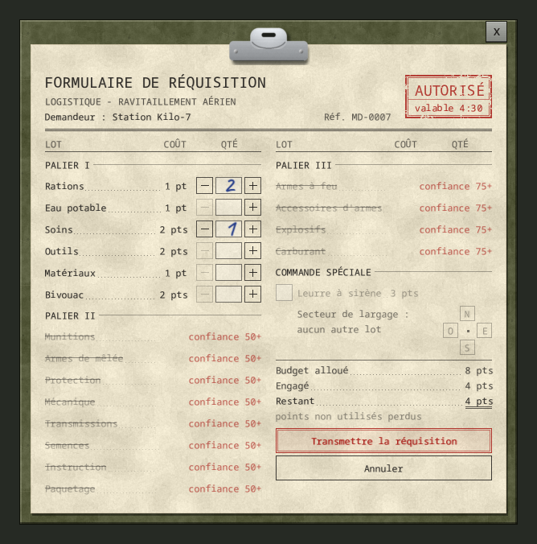

# Formulaire de réquisition

[English](../en/03-requisition-form.md) · [Sommaire du guide](README.md) · Précédent : [Appeler un largage](02-calling-a-drop.md) · Suivant : [Confiance et missions](04-trust-and-missions.md)

Quand la base accepte votre appel, elle répond *« Station Kilo-7, ici Logistique. Transmettez votre réquisition, à vous. »* et le formulaire s'ouvre à côté de la fenêtre radio. Vous choisissez ce que l'hélicoptère apporte.

*Rendu hors jeu : une station neuve, palier I seulement.*

## Budget et paliers

Le tampon rouge **AUTORISÉ** indique combien de temps le formulaire reste valable : **5 minutes réelles**.

Le **budget alloué** dépend de la [confiance](04-trust-and-missions.md) de votre personnage :

| Confiance | 25 (départ) | 50 | 75 | 100 |
|---|---|---|---|---|
| Budget | 8 pts | 12 pts | 16 pts | 20 pts |

- Le **palier I** est toujours ouvert.
- Le **palier II** s'ouvre à la confiance **50**.
- Le **palier III** s'ouvre à la confiance **75**.

Une ligne fermée est barrée et indique la confiance requise, par exemple « confiance 50+ ». **Les points non utilisés sont perdus.**

## Les 18 lots

Chaque unité commandée arrive sous la forme d'une **Caisse de réquisition**. Les objets sont tirés à l'ouverture de la caisse, dans les tables de butin du jeu (et parmi les objets de vos mods).

| Palier | Lot | Coût | Une caisse contient |
|---|---|---|---|
| I | Rations | 1 pt | 4 vivres de longue conservation : conserves, produits secs |
| I | Eau potable | 1 pt | 2 bouteilles ou gourdes remplies d'eau propre |
| I | Soins | 2 pts | 3 articles de premiers secours et pansements |
| I | Outils | 2 pts | 2 outils à main |
| I | Matériaux | 1 pt | 4 matériaux de construction et de fabrication |
| I | Bivouac | 2 pts | 3 objets de camping, d'allumage, de pêche ou de piégeage |
| II | Munitions | 2 pts | 3 cartouches, boîtes ou chargeurs |
| II | Armes de mêlée | 3 pts | 1 vraie arme de combat rapproché |
| II | Protection | 3 pts | 2 équipements de protection ou gilets pare-balles |
| II | Mécanique | 2 pts | 2 pièces ou fournitures d'entretien des véhicules |
| II | Transmissions | 2 pts | 2 radios, appareils électroniques ou éclairages |
| II | Semences | 1 pt | 3 graines ou fournitures de jardinage |
| II | Instruction | 2 pts | 2 manuels de compétences |
| II | Paquetage | 2 pts | 1 sac ou contenant |
| III | Armes à feu | 5 pts | 1 arme à feu, 2 chargeurs et 1 boîte de cartouches |
| III | Accessoires d'armes | 3 pts | 2 viseurs, lampes ou autres pièces d'armes |
| III | Explosifs | 5 pts | 2 bombes ou engins incendiaires |
| III | Carburant | 3 pts | 1 bidon plein d'essence |

L'administrateur du serveur peut changer les coûts, les paliers et les lots, ou retirer les explosifs. Votre formulaire affiche toujours la vraie liste du serveur.

## Transmettre ou annuler

- Réglez les quantités avec **+** et **−**. Le **+** se grise quand le budget ne suffit plus.
- **Transmettre la réquisition** : votre personnage lit sa réquisition, la base confirme, et l'hélicoptère part comme d'habitude. L'annonce radio ne dit jamais ce que vous avez commandé.
- **Annuler**, Échap, ou s'éloigner d'une radio posée : rien n'est dépensé et l'attente entre deux largages ne démarre pas. Rappelez quand vous êtes prêt.
- Si un autre joueur obtient un largage pendant que votre formulaire est ouvert, votre commande est refusée : l'attente a démarré pour tout le serveur.

Dans le coffre de la caisse, vous trouvez une caisse par unité, au nom de son lot, par exemple **Caisse de réquisition : Rations**. Clic droit : **Ouvrir la caisse de ravitaillement**.

*En jeu (version anglaise) : le formulaire s'ouvre à côté de la console du poste de liaison.*

## Leurre à sirène

Sous **COMMANDE SPÉCIALE**, le **Leurre à sirène** (3 pts) largue une caisse factice dont la sirène attire les infectés loin de vous.

*Rendu hors jeu.*

1. Cochez **Leurre à sirène**. Les autres lots se désactivent : un leurre se commande seul.
2. Choisissez le **secteur de largage** : N, E, S ou O. La caisse tombe dans ce quart, à la distance habituelle.
3. Transmettez.

Sur un serveur à [zones de largage](06-server-admin.md#zones-de-largage), l'étape 2 propose un **secteur** au lieu de N, E, S et O : une ville, affichée « < Louisville > » (flèches, ou gauche et droite à la manette). Avec un seul secteur, il est déjà sélectionné. Le leurre tombe alors dans une zone de largage de ce secteur, comme un vrai largage.

Le leurre est **identique** à un vrai largage : même réponse, même hélicoptère, même annonce, même caisse. Personne ne peut le reconnaître avant d'ouvrir le coffre, qui ne contient qu'une **Balise-sirène - DIVERSION**.

- La sirène démarre quand la caisse se pose et hurle pendant **6 heures** de jeu. Les zombies l'entendent jusqu'à **120 cases**, tant que la zone autour de la caisse est chargée.
- Pour l'arrêter : clic droit sur la caisse, **Couper la sirène**. Démonter la caisse l'arrête aussi.
- Un leurre ne change jamais votre confiance.
- Si le secteur n'offre aucun point de largage (bord de la carte), la base vous demande un autre secteur et le formulaire se rouvre.
