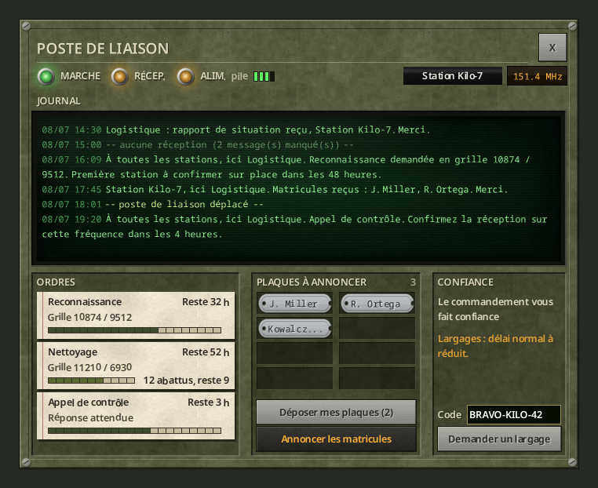
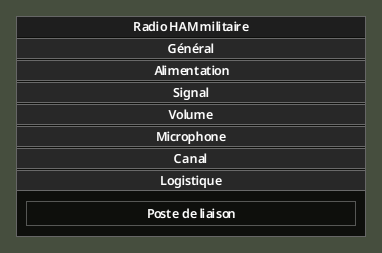
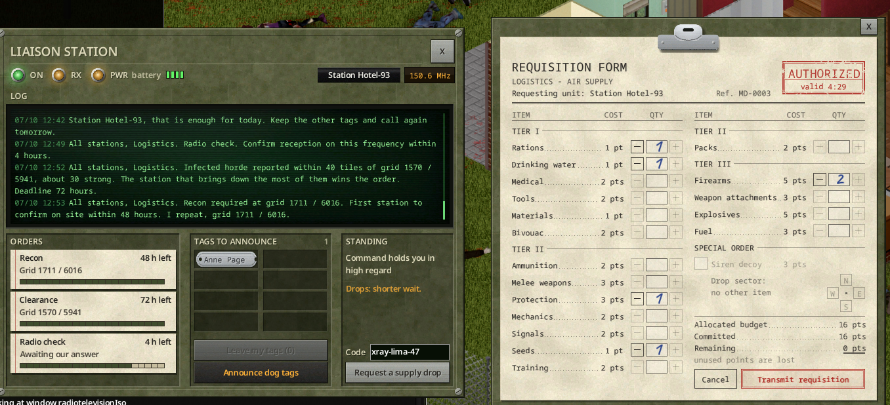

# Poste de liaison

[English](../en/05-liaison-post.md) · [Sommaire du guide](README.md) · Précédent : [Confiance et missions](04-trust-and-missions.md) · Suivant : [Administration](06-server-admin.md)

Un poste de liaison est une radio militaire fixe dont votre station fait sa base. Il garde le journal de ce que dit la base, affiche vos ordres et votre confiance, et rapporte davantage pour les matricules annoncés.

*Rendu hors jeu.*

## Installer le poste

1. Posez un **Radioamateur de l'Armée américaine** (toute radio fixe haut de gamme capable d'émettre convient).
2. Alimentez-le (secteur, groupe électrogène ou pile), allumez-le, réglez-le sur la fréquence militaire.
3. Clic droit, **Options de l'appareil**. Dans la section **Logistique**, appuyez sur **Poste de liaison**.

*Rendu hors jeu.*

- La première fois, le poste est installé et la console s'ouvre.
- Chaque station a **un seul** poste. Sur une autre radio, le bouton demande *« Transférer le poste de liaison ici ? »*.
- Le bouton est grisé sur le poste d'une autre station.
- Si la radio est ramassée ou détruite, le poste est perdu. Réinstallez-le.

## La console

**En haut** : trois voyants. **MARCHE** (alimenté et allumé), **RÉCEP.** (clignote à l'arrivée d'un message), **ALIM.** avec la source (secteur, groupe électrogène, pile) et la charge de la pile. À droite : votre indicatif et la fréquence.

**JOURNAL** : tout ce que la base dit à votre station ou à toutes les stations, avec la date et l'heure. Le poste ne reçoit que s'il est allumé, alimenté et réglé. Sinon, une ligne marque le trou : *« -- aucune réception (3 message(s) manqué(s)) -- »*. Le poste continue de recevoir pendant votre absence.

**ORDRES** : les missions en cours, avec la grille, le temps restant et une barre de progression. Le nettoyage affiche « 12 abattus, reste 9 » (ou « horde non repérée ») ; l'appel de contrôle, « Réponse attendue » ou « Réception confirmée ».

**PLAQUES À ANNONCER** : les plaques déposées au poste par les membres de votre station (survolez une plaque pour voir qui l'a déposée).
- **Déposer mes plaques (N)** transfère les plaques de soldats tombés de votre inventaire au poste.
- **Annoncer les matricules** les lit à la base. Les matricules annoncés depuis le poste rapportent 50 % de confiance en plus.

**CONFIANCE** (personnelle au personnage qui consulte le poste) : votre confiance en mots, et son effet sur les largages (« Largages : délai réduit. »).

**Code** et **Demander un largage** : le même appel que depuis la fenêtre radio. Le [formulaire de réquisition](03-requisition-form.md) s'ouvre à côté de la console.

La console reste ouverte quand vous utilisez ses boutons, et se ferme si vous vous éloignez de la radio.

*En jeu (version anglaise).*

> La console ne dit jamais si la radio est sur la fréquence militaire. Fiez-vous aux notes.
