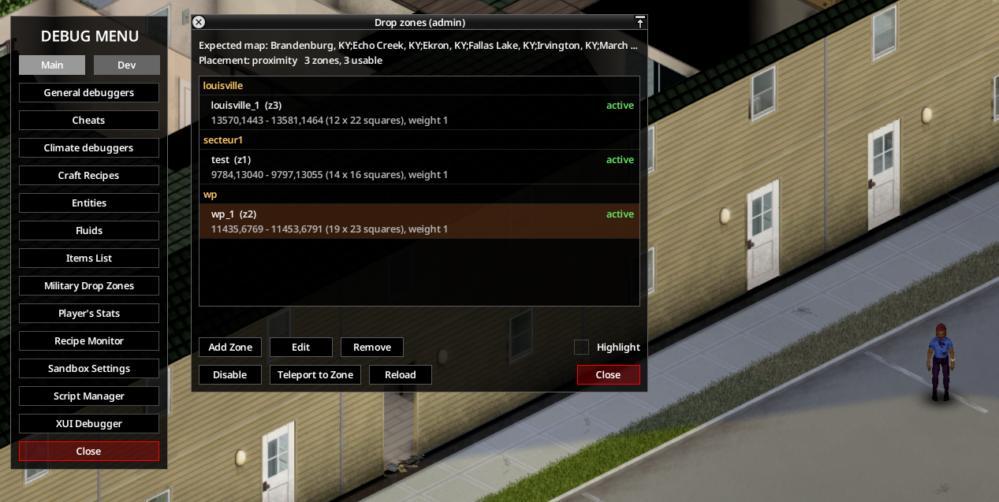
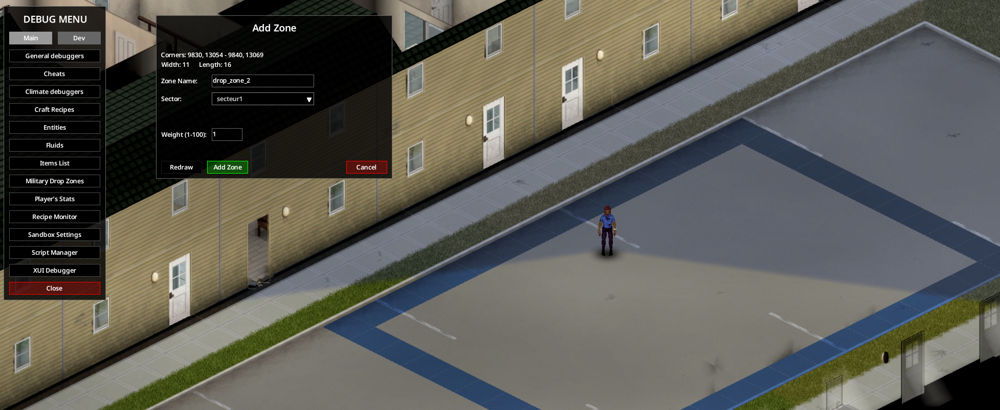

# Administration

[English](../en/06-server-admin.md) · [Sommaire du guide](README.md) · Précédent : [Poste de liaison](05-liaison-post.md) · Suivant : [Extraction Fulton](07-fulton.md)

## Options du bac à sable

Toutes les options sont sur la page **Military Drop** des options du bac à sable. Heures et jours sont en temps de jeu.

### Changer une option en cours de partie

Les options se changent sans redémarrer, sauf les deux fréquences (voir plus bas).

- **Solo** : menu de debug › **Options bac à sable**, modifier les valeurs, **Appliquer**.
- **Multijoueur** : panneau d'admin › **Options bac à sable** (droit de modifier les options du bac à sable), modifier les valeurs, **Appliquer**. Le serveur les enregistre dans `Zomboid/Server/<nom du serveur>_SandboxVars.lua` et les envoie à tous les joueurs connectés.
- `/reloadoptions` et `/changeoption` ne rechargent que les réglages du serveur (`<nom du serveur>.ini`), jamais les options du bac à sable. Modifier à la main `<nom du serveur>_SandboxVars.lua` pendant que le serveur tourne ne fait rien avant son redémarrage : le fichier n'est lu qu'au démarrage, et un **Appliquer** depuis le panneau le réécrit.

Le mod lit ses options à chaque usage : une nouvelle valeur vaut pour l'appel, le largage, la commande, la mission ou le crash suivant. Ce qui existe déjà garde la valeur de sa création : un vol en cours, une horde déjà apparue, l'échéance d'une mission, un site de crash. Dans la minute de jeu qui suit le changement, la console (`console.txt`, ou le journal du serveur) affiche `[MilitaryDrop] sandbox options changed: …`, et quelques changements sont appliqués à ce moment :

- passer au code de la semaine chiffré lance la station de chiffres si la partie a été chargée dans un autre mode ; le quitter fait taire la station ;
- le carnet est ajouté au butin de l'armée, ou retiré, avec sa nouvelle fréquence (conteneurs remplis ensuite seulement) ;
- les lots de réquisition sont préparés quand le formulaire est activé ;
- l'outil des zones de largage, s'il est ouvert, affiche le nouveau mode de placement.

**Redémarrage requis** : `Frequency` et `NumbersStationFrequency`. Une chaîne radio garde la fréquence de sa création au chargement du monde ; jusqu'au redémarrage, la base répond toujours sur l'ancienne fréquence et les notes la donnent encore.


### Largages

| Option | Clé | Défaut | Effet |
|---|---|---|---|
| Heures entre deux largages | `CooldownHours` | 168 | Attente minimale entre deux largages, pour tout le serveur. Multipliée par le facteur de confiance de l'appelant (×1,5 à ×0,6). |
| Fréquence militaire (MHz) | `Frequency` | 0 | 0 : fréquence libre tirée au hasard entre 120 et 170 MHz, écrite sur les notes. Une valeur fixe est visible par tous les joueurs. 112,2 MHz est réservée. Redémarrage requis. |
| Distance minimale du largage | `DropMinDistance` | 150 | Cases au minimum entre l'appelant et le point de largage. |
| Distance maximale du largage | `DropMaxDistance` | 400 | Cases au maximum entre l'appelant et le point de largage. |
| Rappel de la grille toutes les (heures) | `DropRepeatHours` | 6 | Heures de jeu entre deux rappels de la grille d'un largage dont aucune caisse de ravitaillement n'a été ouverte, pendant `TrustDropLostHours` au plus. 0 = aucun rappel. |
| Zombies au largage (minimum) | `MinZombies` | 3 | 0 et 0 : aucun zombie. |
| Zombies au largage (maximum) | `MaxZombies` | 30 | Zombies qui apparaissent autour de la caisse. |
| Caisses par largage | `CaseRolls` | 6 | Tirages de butin quand le formulaire est désactivé. |
| Fumée sur la caisse (minutes) | `CrateSmokeMinutes` | 60 | Nécessite Signal Smoke. Fumée verte sur la caisse. 0 : aucune. |

### Code, notes et carnets

| Option | Clé | Défaut | Effet |
|---|---|---|---|
| Code d'authentification | `AuthCode` | Code de la semaine, chiffré | Aucun / Code fixe, en clair sur les notes / Code de la semaine, en clair sur les notes / Code de la semaine, chiffré (station de chiffres et carnet). 3 codes faux dans la journée : la base ignore l'appelant jusqu'au lendemain. |
| Fréquence de la station de chiffres (MHz) | `NumbersStationFrequency` | 0 | 0 : fréquence libre des ondes courtes tirée au hasard, de 10 à 25 MHz. Mode chiffré seulement. Redémarrage requis. |
| Fréquence des notes militaires | `NoteDropRate` | Normale (1/50) | Extrêmement rare 1/1000, Très rare 1/500, Rare 1/100, Normale 1/50, Courante 1/25, Débogage 1/2. |
| Notes seulement sur les zombies militaires et policiers | `NotesOnlyArmyPolice` | vrai | Seules les tenues de la liste ci-dessous portent des notes. |
| Tenues qui portent les notes | `NoteOutfits` | `Army;Police;Sheriff` | Mots cherchés dans le nom de la tenue (reconnaît aussi les tenues des mods). |
| Tenues exclues | `NoteOutfitsExcluded` | `Stripper` | Tenues qui ne portent jamais de note ni de carnet. |
| Fréquence des carnets de codes | `CodebookDropRate` | Rare (1/100) | Même échelle. Règle aussi leur fréquence dans les réserves de l'armée. |
| Tenues qui portent les carnets | `CodebookOutfits` | `Army` | Mots cherchés dans le nom de la tenue. |

### Confiance

| Option | Clé | Défaut | Effet |
|---|---|---|---|
| Plafond quotidien de confiance | `TrustDailyCap` | 10 | Confiance maximale gagnée par jour, hors largages. 0 : seuls les largages comptent. |
| Bonus du poste de liaison (pour cent) | `TrustPostBonus` | 50 | Confiance en plus pour les échanges faits depuis le poste de liaison. |
| Ligne coupée (jours) | `TrustLineCutDays` | 3 | Jours sans largage quand la confiance passe sous 15. 0 : jamais coupée. |
| Heures pour récupérer un largage | `TrustDropLostHours` | 48 | Passé ce délai, un largage non ouvert est perdu (−10). |
| Érosion de la confiance | `TrustErosion` | faux | Chaque jour sans échange, la confiance revient d'un point vers sa valeur de départ. |
| Confiance : rapport de situation quotidien | `ReportGain` | 1 | 0 désactive les rapports. |
| Confiance : matricule annoncé | `DogTagGain` | 2 | 0 désactive les plaques. |
| Confiance : reconnaissance | `ReconGain` | 3 | 0 désactive les reconnaissances. |
| Échéance de la reconnaissance (heures) | `ReconHours` | 48 | |
| Heures entre deux reconnaissances | `ReconIntervalHours` | 24 | Après la clôture de la précédente, à 25 % près. |
| Confiance : nettoyage | `CleanupGain` | 5 | 0 désactive les nettoyages. |
| Échéance du nettoyage (heures) | `CleanupHours` | 72 | |
| Taille de la horde du nettoyage | `CleanupQuota` | 30 | Ordre rempli quand 90 % de la horde est morte. |
| Heures entre deux nettoyages | `CleanupIntervalHours` | 48 | À 25 % près. |
| Confiance : appel de contrôle | `ControlGain` | 1 | 0 désactive les appels de contrôle. |
| Durée de l'appel de contrôle (heures) | `ControlHours` | 4 | |
| Heures entre deux appels de contrôle | `ControlIntervalHours` | 24 | À 25 % près. |

### Réquisition et leurre

| Option | Clé | Défaut | Effet |
|---|---|---|---|
| Formulaire de réquisition | `RequisitionForm` | vrai | Désactivé : caisses de ravitaillement aléatoires, comme dans le mod Build 41. |
| Budget de réquisition (pour cent) | `RequisitionBudget` | 100 | À 100 : 8 points à la confiance 25, 12 à 50, 16 à 75, 20 à 100. |
| Coûts de réquisition (pour cent) | `RequisitionCostMultiplier` | 100 | Ajuste chaque coût, arrondi, au moins 1 point. |
| Confiance des lots du deuxième palier | `RequisitionTier2` | 50 | |
| Confiance des lots du troisième palier | `RequisitionTier3` | 75 | |
| Explosifs en réquisition | `RequisitionExplosives` | vrai | |
| Largage leurre | `DecoyEnabled` | vrai | Propose le leurre à sirène dans le formulaire. |
| Coût du leurre (points) | `DecoyCost` | 3 | |
| Durée de la sirène du leurre (heures) | `DecoySirenHours` | 6 | |
| Portée du bruit de la sirène (cases) | `DecoyNoiseRadius` | 120 | Seulement quand la zone autour de la caisse est chargée. |

### Extraction Fulton

Voir [Extraction Fulton](07-fulton.md).

| Option | Clé | Défaut | Effet |
|---|---|---|---|
| Fulton : récompense (pour cent) | `FultonValue` | 100 | Multiplie la confiance payée pour les objets envoyés par Fulton. Toujours limitée par le plafond quotidien, sauf le remède (Zombie Virus Vaccine). 0 : extractions Fulton désactivées (bouton radio grisé). |
| Fulton : créneau de passage (minutes) | `FultonWindowMinutes` | 30 | Minutes de jeu pour lâcher un Fulton après une demande radio. 5 au moins. |
| Fulton : fréquence dans le butin (pour cent) | `FultonLootRate` | 100 | Bouteilles d'hélium (magasins de cadeaux et de jouets, réserves de l'armée) et kits endommagés (réserves de l'armée, pilote d'une épave Mayday 25 %, caisse sans commande 5 %). 0 : aucun. S'applique aux conteneurs remplis après un changement. |

### Hélicoptère abattu (branche Mayday)

| Option | Clé | Défaut | Effet |
|---|---|---|---|
| Risque de crash (%) | `CrashChance` | 5 | Probabilité par départ normal ; largages admin et leurres exclus. |
| Bonus d’orage | `CrashStormBonus` | 15 | Points de probabilité ajoutés pendant un orage, maximum total 100 %. |
| Tirs pouvant abattre l’appareil | `CrashGunfire` | faux | Signal client revérifié pour plausibilité au serveur : arme chargée, distance et direction. |
| Chance par tir plausible (%) | `CrashGunfireChance` | 10 | Approche seulement, largages admin et leurres exclus. |
| Effets au sol | `CrashFire` | Feu et fumée | Aucun / fumée / feu et fumée ; un seul foyer initial près du fuselage, règles d’incendie du jeu appliquées. Les sauvegardes conservent leur réglage existant. |
| Durée de la fumée (minutes) | `CrashSmokeMinutes` | 60 | Minutes de jeu ; réémise pour les nouveaux arrivants. Aucun besoin de Signal Smoke. |
| Ravitaillement au crash | `CrashCrates` | faux | Désactivé : la commande est perdue avec l’appareil ; restent l’épave, le matériel récupérable, l’équipage, les documents, la horde et la fumée. Activé : caisses livrées au site. Crash sans effet sur la réputation dans les deux cas. Les sauvegardes conservent leur réglage existant. |
| Objets par lot récupéré | `SalvageRolls` | 3 | Tirages parmi les catégories/tags du jeu et des mods. |
| Tenues du cadavre | `PilotOutfits` | `Army` | Mots recherchés dans les noms de tenue, séparés par `;`. Les deux pilotes zombies supplémentaires portent leur combinaison de vol militaire dédiée. |
| Documents du pilote | `PilotDocuments` | vrai | Note et carnet dans le corps ; l’enregistreur reste récupérable. |

Le MAYDAY annonce un secteur approximatif sur la fréquence militaire. Le clic droit sur l’épave ouvre la récupération des pièces ; après retrait de toutes les pièces, la découpe finale suit les règles vanilla. L’enregistreur de vol se lit dans la baie de lecture du poste de liaison (10 minutes de jeu, radio du poste allumée et alimentée ; pause en cas de coupure), puis se transmet à la base sur la fréquence militaire : +10 de réputation au personnage qui le transmet, hors plafond quotidien, une fois par site de crash (crashs admin compris).

### Débogage

| Option | Clé | Défaut | Effet |
|---|---|---|---|
| Journal de débogage | `DebugLog` | faux | Lignes `[MilitaryDrop]` détaillées dans `console.txt`. |

## Fichier des lots de réquisition

Les lots du formulaire sont définis dans `Zomboid/Lua/MilitaryDrop/requisition.txt`, dans le dossier Zomboid du compte système qui lance le jeu ou le serveur. Le fichier est créé au premier démarrage avec les 18 lots par défaut et une notice en anglais.

> Ce fichier est commun à **toutes** les parties solo et à **tous** les serveurs lancés par ce compte.

- Chaque lot a `id`, `enabled`, `group` (palier 1 à 3), `cost` (1 à 99), `count` (objets par caisse, 1 à 20) et un filtre : `categories` (catégories d'affichage des objets), `tags`, `notTags`, `minWeight`, `maxWeight`, `kind` (`ration`, `firearm`, `melee`, `ammo`, `armor`, `attachment`, `pack`), `fluid` (`Water`, `Petrol`), `extras`.
- Pour retirer un lot, mettez `enabled = false`. Ne supprimez pas un lot ajouté : les caisses déjà livrées gardent son identifiant et ne s'ouvrent pas sans lui.
- Vous pouvez ajouter des lots (40 au total au plus), avec leurs textes :

```lua
{
    id = "kitchen", enabled = true, group = 1, cost = 2, count = 3,
    categories = { "Cooking" }, maxWeight = 3,
    texts = { EN = { label = "Kitchen", desc = "Pots, pans and cutlery." },
              FR = { label = "Cuisine", desc = "Casseroles, poêles et couverts." } },
},
```

- Seules des données sont lues, jamais du code. Une erreur de syntaxe garde les 18 lots par défaut ; chaque problème est écrit dans `console.txt` avec son numéro de ligne.
- Supprimez le fichier pour retrouver le fichier par défaut au démarrage suivant.

Recharger sans redémarrer :

- solo, console de débogage : `MilitaryDrop.Requisition.reload()`
- multijoueur, depuis la console de débogage d'un admin : `sendClientCommand(getPlayer(), "MilitaryDrop", "ReloadLots", {})` (rôle admin seulement ; le résumé s'affiche dans la console de l'admin)

## Zones de largage

Par défaut, une caisse tombe entre 150 et 400 cases de l'appelant. Sur un serveur PvP qui a des zones protégées, ce point tombe souvent dans une zone protégée, et la caisse annoncée se ramasse sans aucun risque. Les **zones de largage** permettent à l'admin de choisir où tombent les caisses : des rectangles regroupés en **secteurs** (en général une ville), par exemple un parc, un centre commercial et un immeuble à Louisville. Chaque largage tire une zone au hasard : personne ne peut camper le point exact.

Rien ne change tant que **Placement des largages** n'est pas modifié : la valeur par défaut reste « Près du demandeur ».

### Options

| Option | Clé | Défaut | Effet |
|---|---|---|---|
| Placement des largages | `DropPlacement` | Près du demandeur | **Près du demandeur** : un point tiré entre les distances minimale et maximale du largage, comme avant. **Zones de largage** : dans une zone de l'admin ; sans zone utilisable, une ville vanilla, sinon près du demandeur (voir [Repli](#repli)). **Zones si l'une est proche** : seules les zones plus proches que la portée des zones sont utilisées ; s'il n'y en a aucune, près du demandeur. |
| Secteur des zones de largage | `DropZoneChoice` | Le plus proche du demandeur | **Le plus proche du demandeur**, **Au hasard** ou **Choisi par le joueur**. Une zone de ce secteur est ensuite tirée au hasard, selon son poids. **Choisi par le joueur** : le formulaire de réquisition reçoit un champ **Secteur de largage** (voir [Ce que voient les joueurs](#ce-que-voient-les-joueurs)) ; sans formulaire de réquisition (`RequisitionForm` désactivé), le secteur le plus proche est retenu. |
| Distance minimale des zones de largage | `DropZoneMinDistance` | 0 | Cases, de 0 à 5000. Les zones plus proches du demandeur sont écartées : personne ne peut appeler depuis une zone pour se servir aussitôt. Si toutes les zones sont plus proches, le secteur le plus proche est retenu. 0 : aucune distance minimale. |
| Portée des zones de largage | `DropZoneMaxDistance` | 1500 | Cases, de 100 à 20000. Sert seulement à « Zones si l'une est proche ». |
| Annoncer le nom de la zone | `DropZoneAnnounceName` | vrai | L'annonce et ses rappels donnent le nom de la zone avant la grille. Désactivé : la grille seule. |

Les distances vont du demandeur au bord le plus proche d'une zone (0 à l'intérieur). En mode zones, `DropMinDistance` et `DropMaxDistance` ne servent que lorsque le largage revient près du demandeur. Les largages de l'admin (**Forcer un largage**, direct ou par le formulaire admin) suivent les mêmes règles qu'un appel de joueur, distances mesurées depuis l'admin : placement, choix du secteur, secteurs du leurre.

### Le fichier `dropzones.txt`

Les zones sont gardées dans `Zomboid/Lua/MilitaryDrop/dropzones.txt`, à côté de `requisition.txt`. Le fichier est créé au premier démarrage, sans zone, avec une notice en anglais.

> Comme le fichier des lots, il est commun à **toutes** les parties solo et à **tous** les serveurs lancés par ce compte. Le champ `map` lie les zones à une carte.

Vous pouvez tracer les zones avec l'[outil en jeu](#outil-en-jeu) ou les écrire à la main :

```lua
return {
    version = 1,
    map = "Muldraugh, KY",
    zones = {
        { id = "z1", sector = "Louisville", name = "Central Park", x1 = 12900, y1 = 2100, x2 = 12980, y2 = 2160 },
        { id = "z2", sector = "Louisville", name = "Mall", x1 = 13200, y1 = 2300, x2 = 13290, y2 = 2380, weight = 2 },
        { id = "z3", sector = "Riverside", name = "Main Street", x1 = 6400, y1 = 5380, x2 = 6480, y2 = 5440, enabled = false },
    },
}
```

Les coordonnées ci-dessus sont des exemples : relevez les vôtres en jeu, ou tracez les zones avec l'outil (il affiche les coins et la taille).

| Champ | Contenu |
|---|---|
| `map` | Cartes pour lesquelles les zones sont tracées : noms de dossiers de cartes séparés par `;`, comme dans la ligne `Map=` du serveur (carte vanilla : `Muldraugh, KY`). Facultatif. Une zone peut porter son propre `map`. |
| `id` | Nom unique : lettres, chiffres, `_` et `-`, 16 caractères au plus. L'outil numérote ses zones `z1`, `z2`... |
| `sector` | Groupe de zones, en général une ville. 32 caractères au plus, sans `<` ni `>`. |
| `name` | Nom de la zone, lu dans l'annonce radio. Mêmes limites. |
| `x1`, `y1`, `x2`, `y2` | Rectangle au rez-de-chaussée. Les deux coins font partie de la zone ; de 1 à 300 cases de côté. |
| `weight` | De 1 à 100, 1 par défaut. Une zone de poids 2 est tirée deux fois plus souvent qu'une zone de poids 1 du même secteur. |
| `enabled` | `true` ou `false`, `true` par défaut. |

- **Carte attendue** : une zone dont la carte n'est pas chargée dans la partie en cours est ignorée, avec une ligne dans `console.txt`. L'outil l'affiche « carte non chargée ». Quand le fichier n'a pas de `map`, l'outil y écrit la carte de la partie à sa première modification.
- Seules des données sont lues, jamais du code. Une erreur de syntaxe désactive **toutes** les zones (voir [Repli](#repli)) ; le numéro de ligne est écrit dans `console.txt`. Une zone invalide est écartée (`zone #3 (z3): ...`). 200 zones au plus.
- La caisse tombe **n'importe où dans le rectangle** : herbe, champ, plage, chemin, route, parking. Jamais dans un bâtiment, jamais dans l'eau. Une zone n'a pas besoin de route.
- À chaque chargement, le serveur contrôle chaque zone. Ses remarques s'affichent sur la ligne de la zone dans la liste de l'outil et sont écrites dans `console.txt` comme simples notes (`note:`), pas comme des problèmes du fichier : **aucun terrain libre** (des bâtiments partout, ou de l'eau déjà connue des données de la carte : aucune caisse ne peut y tomber), **chevauche une zone non-PvP** ou **un refuge** (aucune caisse dans cette partie), **hors de la carte**, **carte non chargée**. La section rouge des « problèmes » de la liste ne montre que de vraies erreurs de `dropzones.txt` (erreur de syntaxe, zone invalide écartée, champ inconnu).

Recharger sans redémarrer : le bouton **Rafraîchir** de l'outil, ou depuis la console de débogage d'un admin : `sendClientCommand(getPlayer(), "MilitaryDrop", "ZoneReload", {})`.

> Après une modification à la main, **rechargez avant d'utiliser l'outil**. L'outil réécrit tout le fichier à partir de la dernière version lue : les modifications non rechargées seraient perdues, de même que vos propres commentaires. Il refuse d'écrire tant que le fichier contient une erreur de syntaxe, pour ne jamais écraser une modification à la main.

### Outil en jeu

Qui le voit : en multijoueur, les rôles qui peuvent modifier et recharger les options du serveur (admin, et tout rôle doté de la capacité `ChangeAndReloadServerOptions` ; l'hôte d'une partie coop aussi). En solo, le mode debug seulement. Le serveur revérifie : la commande de tout autre joueur est refusée et notée au journal.

Où l'ouvrir :

- **Multijoueur** : bouton **Zones de largage** du panneau d'admin du jeu.
- **Solo, mode debug** : clic droit au sol › **Debug** › **Main** › **Zones de largage** ; aussi dans la fenêtre de debug (icône en forme d'insecte en bas de la barre d'icônes à gauche, onglet **Main**), ou depuis la console de débogage : `MilitaryDrop.ZonesWindow.open(getPlayer())`.

La fenêtre **Zones de largage (admin)** reprend le panneau des zones d'animaux du jeu. En tête : la carte attendue, le mode de placement et le nombre de zones utilisables. La liste montre les zones groupées par secteur, avec leur état (active, désactivée, carte non chargée), leurs coins, leur taille, leur poids et leurs avertissements, puis les premiers problèmes du fichier. Cochez **Surbrillance** (en haut à droite des boutons, décochée au départ, retenue jusqu'à ce que vous quittiez la partie) pour éclairer au sol, en continu, les cases du pourtour de chaque zone : vert active, gris désactivée, orange carte non chargée, la zone sélectionnée plus marquée. Seules les cases chargées autour de vous s'éclairent, puis les nouvelles à mesure que vous vous déplacez ; vous seul les voyez, et elles disparaissent quand vous décochez la case ou fermez la fenêtre (elles restent pendant l'édition). Les messages de l'outil (zone ajoutée, refus, fichier rechargé) s'affichent dans la fenêtre, jamais au-dessus de votre personnage : les joueurs proches ne voient rien.



Boutons :

- **Ajouter une zone** : tracer une nouvelle zone (ci-dessous).
- **Modifier** : changer le nom, le secteur ou le poids de la zone sélectionnée, ou la retracer (ci-dessous).
- **Retirer** : demande d'abord « Voulez-vous vraiment retirer ... ? ».
- **Activer** / **Désactiver**.
- **Se téléporter sur la zone** : au centre de la zone, au rez-de-chaussée. Demande le droit de téléportation (capacité `TeleportToCoordinates` en multijoueur).
- **Rafraîchir** : relit `dropzones.txt`.
- **Fermer** (ou Échap).

Manette : croix haut et bas pour choisir une zone, A modifie, X active ou désactive, Y ajoute, B ferme.

#### Ajouter une zone

1. Appuyez sur **Ajouter une zone**. La liste se masque et un éditeur s'ouvre en haut à gauche de l'écran.
2. Tracez le rectangle au sol avec le **clic gauche** : appuyez, faites glisser et relâchez, ou cliquez un coin puis le coin opposé. Pendant le tracé, les clics ne servent qu'à tracer : ni attaque, ni déplacement, ni porte ouverte, ni menu contextuel. Les cases sont prises au rez-de-chaussée, quel que soit votre étage. Le pourtour du rectangle s'éclaire au sol pendant le tracé (bleu, rouge au-delà de 300 cases) ; l'éditeur affiche les coins, la **Largeur** et la **Longueur**, en rouge au-delà de 300 cases.
3. Après le second coin, le rectangle est figé. Clic droit ou Échap annule le tracé en cours ; un second Échap ferme l'éditeur.
4. Remplissez **Nom de la zone**, **Secteur** (un secteur connu, ou **Nouveau secteur...** et son nom dans **Nouveau secteur**) et **Poids (1-100)**, puis appuyez sur **Ajouter une zone**.
5. Le serveur contrôle la zone et répond dans l'éditeur : « Zone de largage z4 ajoutée. », avec ses avertissements, ou un refus (trop grande, hors de la carte, chevauchement d'une zone non-PvP ou d'un refuge, déjà 200 zones, fichier avec une erreur de syntaxe). Il écrit `dropzones.txt` et le recharge. En cas de succès, l'éditeur se ferme et la nouvelle zone est sélectionnée dans la liste. **Annuler** revient à la liste.



Manette : la croix déplace la case visée (en partant de la vôtre), A fixe le premier coin puis le second, B annule le tracé. Une fois le rectangle tracé, la croix parcourt le formulaire et B annule.

#### Modifier une zone

Sélectionnez la zone et appuyez sur **Modifier**. Changez son **Nom de la zone**, son **Secteur** ou son **Poids**, ou appuyez sur **Retracer** et tracez-la de nouveau : l'ancien rectangle reste surligné en gris jusqu'au nouveau tracé, et revient si vous annulez. **Enregistrer** n'envoie que les champs modifiés, avec les mêmes contrôles qu'une nouvelle zone (« Rien à enregistrer. » si rien n'a changé). Tant que `dropzones.txt` contient une erreur de syntaxe, la modification est refusée et rien n'est écrit.

### Ce que voient les joueurs

- L'annonce et ses rappels nomment la zone : « Caisse de ravitaillement livrée sur la zone Central Park, grille 12937 / 2125. » Avec **Annoncer le nom de la zone** désactivé, ils donnent la grille seule. Le repère de carte ne change pas.
- La liste des zones n'est jamais envoyée aux joueurs, et la surbrillance des zones ne s'affiche que sur l'écran de l'admin, outil ouvert. Les joueurs découvrent les zones par les annonces.
- **Leurre** : en mode zones, le formulaire propose un sélecteur de secteur (« < Louisville > », flèches, ou gauche et droite à la manette) au lieu de N, E, S et O. Avec un seul secteur, il est sélectionné d'office et affiché, sans choix. Le leurre tombe dans une zone de ce secteur, comme un vrai largage, avec la même annonce. Près du demandeur, le leurre garde N, E, S et O ; le formulaire admin suit les mêmes règles.
- **Secteur choisi par le joueur** (**Secteur des zones de largage** : *Choisi par le joueur*) : chaque fois que le demandeur aurait un largage en zone (zones de largage, zones à portée avec « Zones si l'une est proche », ou villes vanilla du repli), le formulaire affiche un champ **Secteur de largage** au-dessus du budget, avec le même sélecteur. Il propose les secteurs actifs qui ont au moins une zone au-delà de la distance minimale (ou le seul secteur le plus proche si aucun n'en a), et la commande ne part pas tant qu'aucun secteur n'est choisi. Seul le secteur se choisit : la zone reste tirée au poids dans ce secteur, et le nom des zones n'est jamais affiché. Le leurre se sert du même champ, donc de la même liste. Le serveur revérifie le secteur (un secteur désactivé ou sorti de portée entre-temps fait refuser la commande) ; un secteur sans point de largage possible fait demander un autre secteur et rouvre le formulaire. Le formulaire admin a lui aussi ce champ.
- La confiance ne change pas : un joueur extérieur qui ouvre la caisse coûte toujours 5 points au demandeur.

### Repli

Avec **Zones de largage** et aucune zone utilisable (aucune zone, toutes désactivées, carte non chargée, ou erreur de syntaxe) :

1. **Villes vanilla**, seulement si la carte vanilla (`Muldraugh, KY`) est chargée : Louisville, Valley Station, West Point, Muldraugh, Riverside, Brandenburg, Ekron, Irvington, Echo Creek, March Ridge, Fallas Lake et Rosewood. Chaque ville est un secteur d'une seule zone, de 150 cases autour de son centre, choisi avec les mêmes règles (le plus proche, au hasard ou par le joueur, distance minimale).
2. Sinon, **près du demandeur**, comme avant. Le serveur écrit un avertissement dans `console.txt`, et les admins connectés reçoivent le message « Aucune zone de largage utilisable : la caisse tombe près du demandeur. Vérifiez les zones de largage. »

Avec **Zones si l'une est proche**, un appel loin de toute zone tombe simplement près du demandeur, sans avertissement. Une carte de mod sans zone revient près du demandeur.

### Ce que le mod ne fait jamais

- **Une caisse dans l'eau ou dans un bâtiment.** Le point est tiré n'importe où dans la zone, hors des bâtiments et de l'eau que connaissent les données de la carte. Celles-ci ne connaissent que l'eau des endroits déjà approchés par les joueurs dans cette partie : un point tiré sur un lac inconnu reste possible. À la livraison, une fois la zone chargée, les quatre cases sous la caisse sont revérifiées (extérieures, libres, sans eau ni véhicule) et la caisse passe sur la case convenable la plus proche dans la zone.
- **Une caisse hors de sa zone.** Si aucune case de la zone tirée ne convient, le serveur essaie une autre zone du même secteur, puis répond à l'appelant « aucune zone de largage sûre » : le largage ne part pas et le formulaire reste ouvert. À la livraison, la caisse n'est posée que sur une case sèche et libre de la zone ; sinon la livraison attend.
- **Une caisse dans une zone non-PvP ou un refuge**, même créé après la zone.
- **Envoyer la liste des zones aux joueurs.**

### Limites

- Rectangles au rez-de-chaussée seulement, 300 cases de côté au plus, 200 zones en tout.
- Une zone tracée sur un lac ou sur l'Ohio ne donne jamais de caisse dans l'eau : « aucune zone de largage sûre » si les données de la carte connaissent déjà cette eau (avertissement **aucun terrain libre**), sinon le largage est annoncé mais sa caisse attend une case sèche de la zone et ne tombe jamais. Ne tracez pas de zone sur l'eau.
- Les villes vanilla ne sont connues que pour la carte vanilla. Sur une carte de mod, tracez vos propres zones.
- Avec un seul secteur et beaucoup de joueurs, la zone devient un lieu de rendez-vous régulier : c'est voulu sur un serveur PvP, à équilibrer avec **Heures entre deux largages**.
- En mode zones, tout le monde sait déjà où regarder : un leurre surprend moins. Il ressemble pourtant à un vrai largage jusqu'à ce qu'on entende sa sirène ou qu'on ouvre sa caisse.

## Outils d'admin en jeu

Clic droit sur une radio militaire (dans l'inventaire ou posée) :

- **Forcer un largage (admin)** : ouvre le formulaire tamponné **ADMIN**, avec tous les lots et 20 points. Ni code, ni contrôle de la radio, ni attente. Les coordonnées vous sont envoyées en privé, le largage ne compte pas pour la confiance et l'attente entre deux largages ne démarre pas. Formulaire désactivé : le largage part aussitôt avec des caisses aléatoires. Il suit le **Placement des largages** comme un appel de joueur, distances mesurées depuis vous : avec des zones de largage, il tombe dans une zone, le formulaire peut afficher le champ **Secteur de largage** et son leurre propose les secteurs.
- **Missions (admin)** : **Lancer une reconnaissance**, **Lancer un nettoyage**, **Lancer un appel de contrôle**, ou clore la mission en cours (**Clore … en cours**). Une mission close est annoncée comme annulée, sans récompense.
- **Faire crasher le prochain hélicoptère** : programme un seul crash au prochain départ du mod, y compris un largage forcé ou un leurre. Confirmation privée, ordre conservé avec la sauvegarde ; cliquer plusieurs fois ne cumule pas les crashes. Un vol déjà parti continue et une attente HEF ne consomme pas l’ordre. Pour essayer : activer l’option, puis forcer un largage et valider le formulaire.

Qui les voit : en solo, le mode debug seulement. En multijoueur, les rôles qui peuvent déclencher des événements (admin, et tout rôle doté de la capacité `MakeEventsAlarmGunshot`). Le serveur revérifie.

Les zones de largage ont leur propre outil, dans le panneau d'admin du jeu : voir [Outil en jeu](#outil-en-jeu).

## Fichiers gardés par le mod

| Fichier | Contenu |
|---|---|
| `Zomboid/Lua/MilitaryDrop/requisition.txt` | Lots de réquisition (ci-dessus). |
| `Zomboid/Lua/MilitaryDrop/dropzones.txt` | Zones de largage (ci-dessus). |
| `Zomboid/Lua/MilitaryDrop/<mode>_<partie>_seed.txt` | Graine secrète de la partie : codes de la semaine, table du carnet, fréquences tirées au hasard. Serveur seulement. |
| `Zomboid/Lua/MilitaryDrop/<mode>_<partie>_code.txt` | Code fixe (mode code fixe). Serveur seulement. |
| `Zomboid/Lua/MilitaryDrop/code_<sp ou mp>_<partie>_<joueur>.txt` | Code saisi par un joueur, gardé sur son ordinateur. |

Ne partagez ni ne supprimez jamais la graine en cours de partie : les notes et carnets déjà trouvés ne correspondraient plus. Confiance, stations, missions et postes sont sauvegardés avec le monde, dans des données que les clients ne peuvent pas lire.

Un monde neuf reçoit des secrets neufs (depuis la 0.4.3). Sur un serveur multijoueur, la partie `<partie>` de ces noms est le nom du serveur, qui ne change pas quand on efface le monde. Quand le jeu crée un monde neuf (pas de `map_t.bin` dans la sauvegarde, `map_ver.bin` en solo), le mod tire une nouvelle graine et un nouveau code fixe et réécrit les deux fichiers ; le journal du serveur affiche `[MilitaryDrop] new world: the code seed and the fixed code are drawn again`. Un monde qui continue garde ses fichiers. Un serveur remis à zéro avant la 0.4.3 utilise encore la graine de son monde précédent : arrêtez le serveur et supprimez les deux fichiers pour en tirer de nouveaux, avant que les joueurs trouvent mémos ou carnets.

## Caisse au contenu inattendu

Le serveur écrit toujours ces lignes, même sans le journal de débogage, dans `Zomboid/console.txt` (solo), `Zomboid/server-console.txt` (serveur dédié) ou `Zomboid/coop-console.txt` (partie hébergée). Cherchez `crate contents` :

| Ligne | Sens |
|---|---|
| `crate contents at start: entry MilitaryDrop_SupplyCrate present, … unchanged since this mod declared it` | Normal. `CHANGED by another mod (…)` ou `missing` : un autre mod a modifié ou retiré la distribution du coffre de la caisse. |
| `crate contents for drop <id> at x,y (<commande>): … , as ordered, our OnFillContainer fill: once` | Une ligne par caisse posée : contenu du coffre juste après l'atterrissage. |
| `crate contents differ from the order: drop <id>, expected …, found …` | Le coffre ne correspond pas à la commande dès l'atterrissage : les types en trop désignent souvent le mod en cause. |
| `crate container refilled by another mod (forceVehicleDistribution?) for drop <id>` | Un autre mod a re-rempli la caisse plus tard ; la commande est rendue une fois (`order restored`), jamais après un vidage. |
| `crate contents changed for drop <id> …, trunk also holds …` | Le coffre contient d'autres objets que ceux du largage : un joueur y a rangé ses affaires, ou un autre mod l'a re-rempli. |
| `crate contents: supply crate trunk … filled without a drop id` | Coffre d'une caisse inconnue rempli hors d'un largage : caisses au hasard. |

La liste des mods actifs figure déjà dans le même fichier (lignes `loading <id>`). Les caisses et épaves portent le marqueur `resetedContainers` respecté par Specific Loot (KI5) ; un mod qui l'ignore est signalé par les lignes ci-dessus.

## Console de débogage (solo ou hôte)

```lua
print(MilitaryDrop.Server.getCode())                                       -- code en vigueur
print(MilitaryDrop.Config.formatChannel(MilitaryDrop.Config.getChannel())) -- fréquence militaire
print(MilitaryDrop.NumbersStation.frequency)                               -- station de chiffres, en kHz
MilitaryDrop.Trust.debugPrint()                                            -- confiance de chaque personnage
MilitaryDrop.Trust.add(MilitaryDrop.Trust.idFor(getPlayer()), 30, "drop")                                 -- donner de la confiance (station du solo)
MilitaryDrop.Missions.launch("recon")                                      -- "recon", "cleanup" ou "control"
getPlayer():getInventory():AddItem("MilitaryDrop.MilitaryMemo")
getPlayer():getInventory():AddItem("MilitaryDrop.Codebook")
```

Ces commandes lisent la mémoire du serveur : elles marchent en solo, pas depuis un client multijoueur.

## Notes pour le multijoueur

- Le serveur décide et vérifie tout ; les clients ne reçoivent jamais la fréquence tirée au hasard ni le code (seules les notes et la station de chiffres les donnent).
- Un talkie-walkie doit être en main pour émettre : le mod le prend en main automatiquement.
- Trois codes faux d'un joueur ne font pas taire la base pour les autres.
